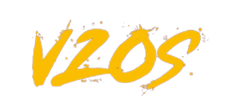

 

    
  </a>

## V2OS Hakkında

Kendim yaptığım bir windows iso dosyası ile ve yaklaşık 2 yıldır araştırdığım, internette bulduğum bilgisayarı iyileştiren, input lag'ınızı minimum seviyeye düşüren ve performansını arttıran yazılımlarla bilgisayar donanımlarınıza hiç zarar vermeden bilgisayarınızı optimize ediyorum.

Bilgisayarın nasıl optimize olucak?
Paket 1 - Kendim yapmış olduğum V2OS(Özelleştirilmiş Windows 10) ve birlikte V2PACK paketi ile optimize ediliyor. Bu en sağlıklısı olucaktır.
Paket 2 - Sadece V2PACK paketini satın almak. FPS Artışında gözle görülebilir bir fark olmayabilir.

Sizin üstünüze düşen görevler nedir?
Anydesk ile bilgisayarınıza bağlanıp gereken işlemleri ben halledeceğim. Eğer Paket 1'i aldıysanız PC'nize format atılacağı için discord üzerinden kamera açmanız gerekebilir.
ve en önemlisi format atarken USB'ye gerek yok.

Paket tamamlandıktan sonra sonuçlar ne olacaktır?
Input Lag'ınız(Giriş Gecikmesi) minimum seviyeye düşmüş olacaktır.
FPS artışının yanında oyununuz daha akıcı olacaktır.(Paket farkları olabilir.)

Not:
PC Optimizasyonunu LAPTOP cihazlarında yapmıyorum.(çünkü neredeyse hiç fark olmuyor.)
VALORANT oyununda FPS farkı olmadı derseniz işlemcinizin iyi olması lazım.
Diğer oyunlarda gözle görülebilir hiç fark olmadı derseniz sizin sisteminizin donanımları düşüktür ve dediğim gibi yazılımlarla PC'nizi iyileştirmeye çalışıyorum herhangi bi Overclock işlemi yoktur.

Satın almak için;
[Discord sunucusuna](https://discord.gg/DdSVZJW) gelebilir veya [vutu](https://discord.com/users/333697573980340225)'yu arkadaş ekleyebilirsiniz.

## 
